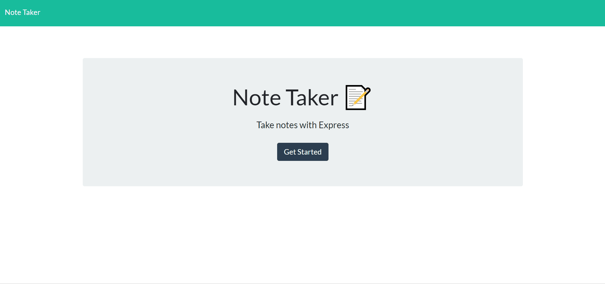

# Note-Taker

## Description
This is an application that can be used to write, save, and delete notes. This application will use an express backend and save and retrieve note data from a JSON file.

## Table of Contents
* [Installation](#installation)
* [Technologies-Libraries](#technologies-libraries)
* [Demo](#demo)
* [Credits](#credits)

## Installation
In your terminal type:
```git clone https://github.com/verlitas/Note-Taker.git```
* Open in Visual Studio to build and run.
* For further instructions, visit https://help.github.com.

## Technologies-Libraries
Express - HTML - CSS - Bootstrap - JavaScript

## Demo


Live link: https://infinite-oasis-71073.herokuapp.com/

## Credits
[Melody Kirshberg](https://github.com/verlitas)  
[UABootCamp](https://bootcamp.ce.arizona.edu/coding/)
